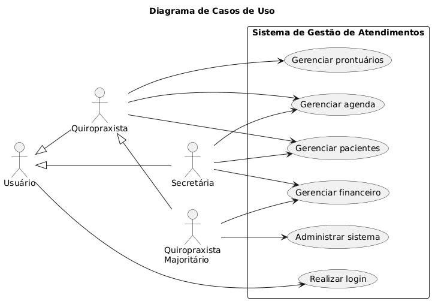
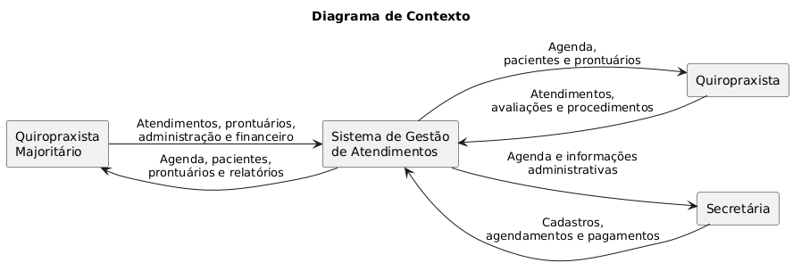
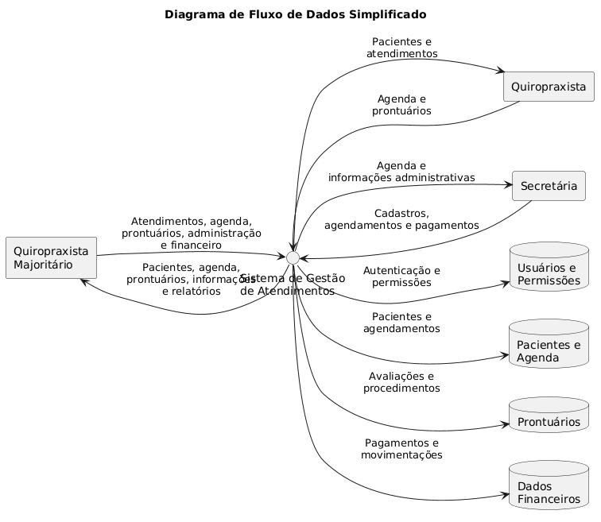

## 4. Visão geral da arquitetura ou fluxo
O sistema foi pensado para auxiliar no gerenciamento dos atendimentos de uma clínica de Quiropraxia, reunindo em um único ambiente as principais informações necessárias para a organização do serviço, como cadastro de pacientes, agenda de atendimentos, prontuários e controle financeiro.

O sistema possuirá três perfis principais de usuários: **Quiropraxista Majoritário, Quiropraxista e Secretária**. Cada usuário deverá acessar o sistema por meio de autenticação, sendo disponibilizadas apenas as funcionalidades correspondentes ao seu perfil e às permissões de acesso estabelecidas.

O **Quiropraxista Majoritário** possuirá acesso mais amplo ao sistema, podendo consultar e atualizar prontuários, além de executar funções administrativas. Entre essas funções estão o gerenciamento de usuários e permissões, bem como o controle financeiro do sistema.

O **Quiropraxista** utilizará o sistema principalmente para consultar e organizar seus atendimentos e acessar os prontuários dos pacientes, registrando informações referentes às avaliações realizadas e aos procedimentos utilizados durante as consultas.

A **Secretária** será responsável principalmente pelas atividades administrativas, como cadastro e consulta de pacientes, organização da agenda, agendamentos, reagendamentos, cancelamentos e registros relacionados aos pagamentos.

As informações utilizadas pela aplicação serão armazenadas em banco de dados, incluindo dados dos usuários, permissões de acesso, dados cadastrais dos pacientes, agendamentos, prontuários e registros financeiros.

O sistema deverá controlar o acesso a essas informações de acordo com o perfil de cada usuário, principalmente em relação aos prontuários e aos dados financeiros.

Nesta etapa, não foram definidos serviços externos ou APIs como parte obrigatória do funcionamento do sistema. Futuramente, poderá ser considerada a integração com serviços de envio de notificações, como e-mail ou WhatsApp, para confirmações e lembretes de atendimentos.

### 4.1 Diagrama de caso de uso

O diagrama de casos de uso apresenta, de forma simplificada, a interação entre os diferentes perfis de usuários e as principais funcionalidades disponíveis no sistema.

Foram considerados os seguintes usuários:

- **Quiropraxista Majoritário**;
- **Quiropraxista**;
- **Secretária**.

Para tornar o diagrama mais claro, as funcionalidades foram agrupadas em casos de uso principais.

O **gerenciamento de pacientes** reúne as atividades relacionadas ao cadastro e à consulta das informações cadastrais dos pacientes.

O **gerenciamento da agenda** compreende as atividades de agendamento, reagendamento, cancelamento e organização ou bloqueio de horários.

O **gerenciamento de prontuários** corresponde à consulta e atualização das informações registradas durante os atendimentos, incluindo a avaliação realizada no paciente e os procedimentos utilizados pelo profissional.

O **gerenciamento financeiro** envolve o registro de pagamentos e a consulta das movimentações financeiras relacionadas aos atendimentos.

O **Quiropraxista Majoritário** possui todas as funcionalidades atribuídas ao Quiropraxista, além de funções administrativas adicionais, como o gerenciamento dos usuários cadastrados, das permissões de acesso e do controle financeiro.

Dessa forma, cada perfil utiliza as funcionalidades necessárias às suas atividades, sendo que o Quiropraxista Majoritário acumula as funções profissionais do Quiropraxista e as atribuições administrativas do sistema.

### 4.2 Diagrama de contexto
O diagrama de contexto apresenta uma visão geral da comunicação entre os usuários e o sistema, sem detalhar os processos internos da aplicação.

Os três perfis de usuários interagem diretamente com o sistema de acordo com suas responsabilidades.

O **Quiropraxista Majoritário**, assim como o Quiropraxista, utiliza o sistema para acompanhar e realizar atendimentos, consultar pacientes, acessar a agenda e registrar avaliações e procedimentos nos prontuários. Além disso, possui acesso às funcionalidades administrativas, como gerenciamento de usuários, permissões e informações financeiras.

O **Quiropraxista** interage principalmente com as informações referentes aos atendimentos e aos prontuários. Por meio do sistema, poderá consultar sua agenda, acessar os dados necessários dos pacientes e registrar avaliações e procedimentos realizados.

A **Secretária** interage com o sistema principalmente para realizar atividades administrativas, como cadastro de pacientes, organização da agenda, agendamentos, reagendamentos, cancelamentos e registros de pagamentos.

O sistema funciona, portanto, como o ponto central de interação entre os diferentes usuários, controlando o acesso às informações conforme as permissões atribuídas a cada perfil.

### 4.3 Fluxo de dados simplificado
O fluxo de dados representa, de maneira simplificada, como as informações circulam entre os usuários, o sistema e os dados armazenados.

O fluxo inicia quando um usuário acessa o sistema utilizando suas credenciais. Após a autenticação, o sistema identifica o perfil do usuário e disponibiliza somente as funcionalidades correspondentes às suas permissões.

De forma geral, o fluxo pode ser representado pelas seguintes etapas:

1. O usuário realiza o login no sistema.
2. O sistema verifica as credenciais e identifica o perfil e as permissões de acesso.
3. A Secretária ou outro usuário autorizado cadastra um novo paciente, quando necessário.
4. Os dados cadastrais do paciente são armazenados no banco de dados.
5. Um atendimento pode ser agendado em um dos horários disponíveis.
6. O sistema registra o agendamento e atualiza a agenda.
7. O Quiropraxista ou Quiropraxista Majoritário consulta sua agenda e as informações necessárias para realizar o atendimento.
8. Durante ou após o atendimento, o Quiropraxista ou Quiropraxista Majoritário pode acessar o prontuário do paciente.
9. São registradas no prontuário informações referentes à avaliação realizada e aos procedimentos utilizados.
10. As informações do prontuário são armazenadas e permanecem vinculadas ao respectivo paciente.
11. As informações relacionadas ao pagamento do atendimento podem ser registradas no módulo financeiro por usuários autorizados.
12. O sistema armazena ou atualiza os registros financeiros correspondentes.
13. As informações ficam disponíveis para consultas posteriores, respeitando as permissões de acesso de cada perfil.

Para facilitar a compreensão do fluxo, os dados foram organizados em quatro grupos principais:

- **Usuários e permissões:** informações de autenticação, perfis e níveis de acesso;
- **Pacientes e agenda:** dados cadastrais dos pacientes, horários e agendamentos;
- **Prontuários:** avaliações, procedimentos realizados e histórico dos atendimentos;
- **Dados financeiros:** registros de pagamentos e movimentações financeiras.

Dessa forma, o sistema atua como elemento central da comunicação, recebendo as solicitações dos usuários e realizando a consulta, o registro ou a atualização das informações correspondentes no banco de dados.

