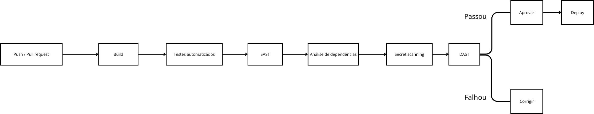
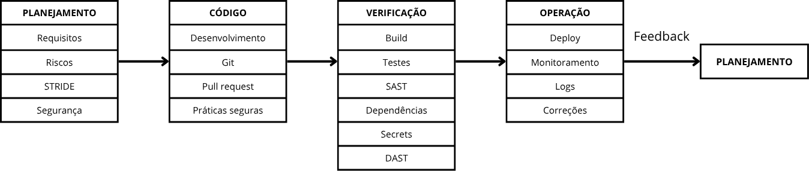

### 24. Pipeline DevSecOps Proposto: Descrição textual (Planejamento, Código, Verificação, Operação)

O pipeline DevSecOps do sistema de gerenciamento da clínica de Quiropraxia tem como objetivo integrar práticas de desenvolvimento, testes e segurança ao longo de todo o ciclo de vida da aplicação. A abordagem busca garantir que os requisitos de segurança sejam considerados desde o planejamento até a operação do sistema, reduzindo a possibilidade de vulnerabilidades chegarem ao ambiente de produção.

O ciclo foi organizado em quatro etapas principais: Planejamento, Código, Verificação e Operação. Essas etapas são executadas de forma contínua, permitindo que alterações realizadas no sistema sejam analisadas, testadas e disponibilizadas de maneira controlada.

### 24.1 Planejamento

A etapa de planejamento inicia o ciclo de desenvolvimento e tem como objetivo definir o que será desenvolvido e quais requisitos de segurança deverão ser considerados. Para o sistema da clínica, são analisadas as funcionalidades relacionadas aos três perfis de usuários: Quiropraxista Majoritário, Quiropraxista e Secretária, considerando as diferentes permissões de acesso de cada perfil.

Nessa etapa são identificados os dados que necessitam de maior proteção, principalmente os dados cadastrais dos pacientes, prontuários, informações de autenticação e registros financeiros. Também são definidos requisitos relacionados à autenticação, autorização, confidencialidade, integridade e rastreabilidade das informações.

A segurança deve ser considerada desde a definição das funcionalidades. Por exemplo, ao planejar a funcionalidade de consulta de prontuários, deve-se estabelecer que somente usuários autorizados poderão acessar essas informações. Da mesma forma, o módulo financeiro deve possuir restrições de acesso de acordo com o perfil do usuário.

Também podem ser identificadas ameaças utilizando técnicas como STRIDE, permitindo antecipar riscos como acesso indevido, alteração não autorizada de dados, exposição de informações e elevação de privilégios.

Ao final dessa etapa, as funcionalidades são transformadas em tarefas de desenvolvimento, acompanhadas dos respectivos requisitos de segurança e critérios de aceitação.

### 24.2 Código

Na etapa de código ocorre a implementação das funcionalidades planejadas. Os desenvolvedores realizam alterações no repositório do projeto, normalmente por meio de branches e pull requests, evitando que alterações sejam inseridas diretamente na versão principal do sistema.

Durante o desenvolvimento, as práticas de desenvolvimento seguro devem ser aplicadas ao código. Como o sistema manipula dados de pacientes e informações financeiras, é importante utilizar mecanismos adequados de autenticação e autorização, validar as entradas fornecidas pelos usuários e utilizar consultas parametrizadas para evitar ataques de injeção.

As senhas não devem ser armazenadas diretamente no código ou no banco de dados em texto puro. Além disso, informações sensíveis, como credenciais de banco de dados, chaves de API e outros segredos, devem ser armazenadas utilizando mecanismos apropriados de gerenciamento de secrets, e não diretamente no repositório.

O controle de acesso também deve ser implementado nessa etapa. O sistema deve verificar não apenas se o usuário está autenticado, mas também se possui permissão para executar determinada operação. Dessa forma, um Quiropraxista, por exemplo, não deve conseguir acessar funcionalidades administrativas destinadas ao Quiropraxista Majoritário apenas manipulando requisições ou URLs.

Cada alteração realizada no código pode iniciar automaticamente o pipeline de integração contínua por meio do GitHub Actions, permitindo que as verificações sejam executadas antes que a alteração seja incorporada à aplicação.

### 24.3 Verificação

A etapa de verificação é responsável por avaliar se o código desenvolvido atende aos requisitos funcionais e de segurança definidos anteriormente.

Quando um push ou pull request é realizado no GitHub, o pipeline pode executar automaticamente diferentes verificações. Inicialmente, o projeto pode ser compilado para identificar erros de construção. Em seguida, são executados os testes automatizados responsáveis por verificar o comportamento das funcionalidades.

Além dos testes funcionais, são realizadas verificações específicas de segurança. Uma ferramenta de SAST (Static Application Security Testing), como o CodeQL, pode analisar o código-fonte procurando padrões associados a vulnerabilidades. Também podem ser verificadas as dependências utilizadas pelo sistema, identificando bibliotecas que possuam vulnerabilidades conhecidas.

Outra verificação importante é a identificação de secrets expostos, evitando que senhas, tokens ou outras credenciais sejam acidentalmente inseridos no repositório. Ferramentas de secret scanning ou soluções como o Gitleaks podem ser utilizadas para essa finalidade.

Caso o sistema esteja disponível em um ambiente de testes, também pode ser realizada uma análise DAST (Dynamic Application Security Testing). Nesse caso, a aplicação é executada e submetida a testes de segurança, permitindo identificar vulnerabilidades que podem não ser encontradas apenas pela análise do código.

O fluxo de verificação pode ser representado da seguinte forma:

Se alguma verificação crítica falhar, o pipeline deve impedir o avanço da alteração para as etapas seguintes. O desenvolvedor deverá corrigir o problema e realizar uma nova alteração para que as verificações sejam executadas novamente.

### 24.4 Operação

Após a aprovação das alterações e a conclusão das verificações, a aplicação pode ser disponibilizada em um ambiente de homologação ou produção. A etapa de operação representa o funcionamento efetivo do sistema e o acompanhamento contínuo de sua segurança e disponibilidade.

No ambiente da clínica, o sistema será responsável por processar as operações relacionadas aos pacientes, agenda, prontuários e informações financeiras. Por esse motivo, é necessário monitorar o comportamento da aplicação e identificar possíveis falhas ou atividades anormais.

Durante a operação, devem ser acompanhados eventos relacionados à autenticação, tentativas de acesso não autorizado, alterações de permissões, acesso aos prontuários e operações financeiras. Os registros de eventos (logs) podem auxiliar na identificação e investigação de incidentes.

Também devem ser realizados procedimentos de manutenção, como atualização das dependências, aplicação de correções de segurança e execução periódica de testes. Caso uma vulnerabilidade seja identificada em produção, ela deve retornar ao ciclo de desenvolvimento para análise, correção, verificação e posterior disponibilização de uma nova versão.

Dessa forma, a operação não representa o final do processo. Ela alimenta novamente a etapa de planejamento, criando um ciclo contínuo de melhoria da segurança.

### 24.5 Ciclo completo

Considerando as quatro etapas, o ciclo DevSecOps do sistema pode ser representado da seguinte maneira:

                    

Assim, o pipeline DevSecOps permite que a segurança seja tratada como uma atividade contínua e integrada ao desenvolvimento do sistema. No contexto da clínica de Quiropraxia, essa abordagem é especialmente importante devido à natureza das informações armazenadas, principalmente os prontuários, dados cadastrais e registros financeiros.

O ciclo também permite estabelecer uma relação entre análise de riscos, desenvolvimento, automação de testes, segurança e operação. Dessa forma, uma vulnerabilidade identificada durante a operação pode gerar uma nova atividade de planejamento, ser corrigida no código, passar novamente pelas verificações automatizadas e somente então ser disponibilizada no ambiente de produção. Isso cria um processo contínuo de detecção, correção e prevenção de vulnerabilidades ao longo de todo o ciclo de vida do sistema.

## 25. Condições de Parada (Break the Build):

Durante o pipeline DevSecOps, algumas falhas de segurança deverão impedir o avanço da aplicação para as próximas etapas ou o seu deploy. Essas condições têm como objetivo evitar que vulnerabilidades conhecidas ou informações sensíveis cheguem ao ambiente de produção.

As principais condições de parada definidas para o sistema são:

**1. Secret ou credencial encontrada no código**

Caso sejam identificadas senhas, tokens, chaves de API ou credenciais de banco de dados diretamente no código ou no repositório, o pipeline deverá ser interrompido. O desenvolvedor deverá remover a informação sensível e utilizar um mecanismo adequado para armazenamento de secrets.

**2. Vulnerabilidade crítica identificada no código**

Caso a análise SAST, realizada por ferramentas como o CodeQL, identifique uma vulnerabilidade classificada como crítica, o pipeline deverá impedir o deploy até que o problema seja corrigido e uma nova análise seja realizada.

**3. Vulnerabilidade crítica ou de alto risco em dependências**

Caso uma biblioteca utilizada pelo sistema possua uma vulnerabilidade conhecida com nível de risco considerado crítico, a aplicação não deverá ser disponibilizada até que a dependência seja atualizada ou que seja definida uma medida de correção adequada.

**4. Falha nos testes de segurança ou autorização**

Caso os testes identifiquem que um usuário consegue acessar uma funcionalidade que não pertence ao seu perfil, o pipeline deverá ser interrompido. Por exemplo, se um Quiropraxista conseguir acessar uma funcionalidade exclusiva do Quiropraxista Majoritário, o deploy deverá ser bloqueado.

**5. Falha nos testes automatizados**

Caso os testes necessários para validar o funcionamento da aplicação apresentem falhas, a alteração não deverá avançar para produção. Isso evita que uma alteração aparentemente simples cause problemas em funcionalidades existentes.

**6. Falha na compilação ou construção da aplicação**

Caso o projeto não consiga ser compilado ou construído corretamente, o pipeline deverá ser interrompido, pois não será possível garantir que a versão gerada esteja funcionando corretamente.

### 25.1 Resumo das Condições

| Condição | Ação do Pipeline |
| --- | --- |
| Secret ou credencial encontrada no código | Bloquear Deploy |
| Vulnerabilidade crítica identificada no código | Bloquear Deploy |
| Vulnerabilidade crítica ou de alto risco em dependências| Bloquear Deploy |
| Falha nos testes de segurança ou autorização | Bloquear Deploy |
| Falha nos testes automatizados| Bloquear Deploy |
| Falha na compilação ou construção da aplicação | Bloquear Deploy |

## 26. Roteiro do Vídeo Final

**Liane 40 segundos - abertura**

“Imagine que uma secretária esteja atendendo vários pacientes durante o dia. Ela precisa controlar agendamentos, pagamentos e informações dos pacientes. Ao mesmo tempo, o quiropraxista precisa acessar prontuários e registrar os atendimentos.

Agora imagine que, nesse sistema, alguém consiga entrar utilizando a conta de um funcionário, alterar um prontuário ou acessar informações de pacientes que não deveria.

É justamente pensando nesses problemas que surgiu a nossa análise de segurança do Quiagenda.
E vale resssaltar que scolhemos esse sistema porque uma das integrantes possui contato com a área de Quiropraxia, permitindo trabalhar com necessidades próximas de uma situação real.

E neste trabalho da disciplina de Engenharia de Software Seguro analisamos as principais ameaças, riscos e possíveis casos de abuso de um sistema de gestão para profissionais de Quiropraxia.

Nosso objetivo foi entender: o que pode dar errado, qual seria o impacto e o que podemos fazer para evitar que isso aconteça?”

**3. Usuários e ativos - 35 segundos vitória**

“Identificamos três principais perfis de usuários.

O administrador ou quiropraxista majoritário, responsável pelas funções administrativas e pelo gerenciamento de pacientes, prontuários, agenda e financeiro.

O quiropraxista, que consulta a agenda e registra procedimentos nos prontuários.

E a secretária, responsável principalmente por pacientes, agendamentos, pagamentos e controle do caixa.

Entre os principais ativos estão as credenciais, dados pessoais, prontuários, históricos de atendimento, registros financeiros, permissões, logs e a disponibilidade do sistema.”

**4. Principais ameaças - 55 segundos Iasmin**

“Para identificar as ameaças, utilizamos o modelo STRIDE.

Em Spoofing, identificamos o risco de um atacante obter as credenciais de um usuário e acessar o sistema utilizando sua identidade.

Em Tampering, existe o risco de alterações não autorizadas nas informações do banco de dados.

Em Repudiation, um usuário pode contestar uma operação, como um pagamento, caso não existam registros confiáveis para comprovar o que aconteceu.

Em Information Disclosure, temos o risco de exposição de dados pessoais e prontuários dos pacientes.

Em Denial of Service, um atacante pode enviar uma grande quantidade de requisições e deixar o sistema indisponível.

E em Elevation of Privilege, um usuário pode explorar uma falha de autorização para conseguir permissões superiores às que deveria possuir.”

**5. Casos de abuso - 45 segundos Adrian**

“Depois da análise STRIDE, criamos casos de abuso para representar situações mais concretas.

No primeiro, um atacante obtém as credenciais de um funcionário e acessa o sistema utilizando sua identidade.

No segundo, temos um ataque de SQL Injection, em que uma entrada maliciosa pode permitir acesso ou alteração não autorizada no banco de dados.

Também identificamos a possibilidade de um usuário negar um pagamento quando o sistema não possui registros confiáveis para comprovar a operação.

E, por último, temos o acesso não autorizado aos dados dos pacientes, permitindo visualizar prontuários e informações que não deveriam estar disponíveis para aquele usuário.”

**6. Riscos prioritários - 55 segundos Adrian**

“Depois de identificar as ameaças, fizemos a análise dos riscos considerando probabilidade e impacto.

O risco de maior pontuação foi o R05, indisponibilidade do sistema, com 16 pontos, classificado como crítico.

Em seguida temos o R01, acesso utilizando a identidade de um usuário legítimo, com 12 pontos, também crítico.

Entre os riscos altos estão a exposição não autorizada dos dados dos pacientes, com 9 pontos, e as alterações não autorizadas no banco de dados e a elevação indevida de privilégios, ambas com 8 pontos.

Já a negação de uma operação de pagamento teve 6 pontos e foi classificada como média.

Essa priorização mostrou quais problemas deveriam receber maior atenção no desenvolvimento do sistema.”

**7. Decisões de arquitetura - 50 segundos Vitória**

“Com base nesses riscos, identificamos algumas necessidades importantes para a arquitetura.

Como o sistema possui diferentes perfis, o acesso deve ser controlado de acordo com as responsabilidades de cada usuário.

Também é necessário proteger o banco de dados e as informações dos pacientes, controlar o acesso aos prontuários e manter registros confiáveis das operações realizadas.

Além disso, a disponibilidade precisa ser considerada, já que a indisponibilidade foi o risco de maior prioridade.

Assim, as decisões de segurança são diretamente relacionadas às ameaças encontradas na análise.”

**8. Práticas de código seguro - 50 segundos Liane**

“Com base nos riscos encontrados, selecionamos duas práticas de código seguro que foram feitas em pseudocódigo.

A primeira é o controle de autenticação e autorização por perfil.

O sistema deve verificar primeiro se o usuário está autenticado e, depois, se ele possui permissão para realizar determinada operação. Essa verificação deve acontecer no servidor, impedindo, por exemplo, que um Quiropraxista tente acessar uma função administrativa apenas modificando uma URL ou requisição.

Tentativas de acesso não autorizado também devem ser registradas nos logs.

A segunda prática é a validação de entradas com consultas parametrizadas.

Os dados fornecidos pelo usuário devem ser validados, verificando campos obrigatórios, tamanho e formato. Além disso, consultas parametrizadas devem ser utilizadas para reduzir o risco de SQL Injection.”

**Iasmin**
"Também utilizamos o OWASP ZAP no OWASP Juice Shop, em ambiente local e controlado.
Foram selecionados três achados: configuração incorreta de CORS, ausência do cabeçalho CSP e divulgação de timestamp Unix, considerado de baixo risco.
A partir deles, propusemos correções como restringir o CORS, configurar o CSP e avaliar a necessidade da exposição do timestamp.”
**Adrian**
“Também definimos testes de segurança antes e durante a implementação final.

Um deles verifica o controle de acesso por perfil, testando se o Quiropraxista Majoritário consegue acessar uma função administrativa, enquanto o Quiropraxista e a Secretária têm o acesso negado quando não possuem essa permissão.

Também definimos um teste de acesso direto, para garantir que a proteção continue funcionando mesmo quando alguém tenta acessar diretamente uma URL ou endpoint restrito.

O segundo grupo de testes verifica a validação de entradas e a proteção contra SQL Injection, utilizando entradas válidas, campos vazios, valores muito grandes e entradas maliciosas de teste.”

**Detecção de intrusões - 40 segundos Vitória**

“Além de prevenir ataques, também precisamos ser capazes de detectá-los.

Prevenir significa criar mecanismos para impedir que uma ameaça aconteça, como autenticação e controle de acesso.

Detectar significa identificar uma atividade suspeita que está acontecendo ou já aconteceu.

Para isso, o sistema deve registrar logs de tentativas de login, acessos e alterações de dados, mudanças de permissões, alterações de configuração e atividades suspeitas.

Definimos três regras principais de detecção.

A primeira identifica várias tentativas de login incorretas em pouco tempo.

A segunda detecta tentativas de acesso ou alteração de prontuários por usuários sem autorização.

E a terceira monitora alterações suspeitas em registros financeiros.”

**Pipeline DevSecOps — 35 segundos Adrian**

“Para integrar essas práticas ao desenvolvimento, propusemos um pipeline DevSecOps dividido em quatro etapas: Planejamento, Código, Verificação e Operação.

No planejamento, são definidos os requisitos de segurança e os riscos.

No código, são aplicadas práticas como controle de acesso, validação de entradas e proteção de secrets.

Na verificação, o pipeline pode executar testes automatizados, análise de código com SAST, análise de dependências, secret scanning e, quando possível, DAST.

Por fim, na operação, são monitorados logs, acessos, alterações e possíveis atividades anormais.

Assim, a segurança não fica concentrada em uma única etapa.”

**Iasmin - Conclusão e aprendizado**
“Com o trabalho, percebemos que segurança não é apenas impedir ataques. É necessário identificar riscos, prevenir, verificar, detectar e corrigir.
O STRIDE ajudou a encontrar as ameaças, a análise de riscos definiu as prioridades e as etapas seguintes transformaram essas decisões em práticas de segurança.
Nosso principal aprendizado foi que a segurança precisa acompanhar todo o ciclo de vida do software.”
